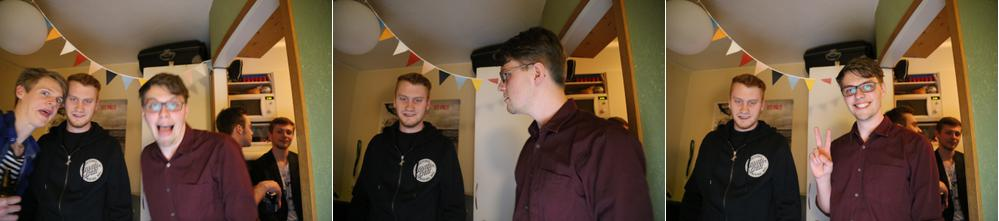

Mustached-octo-hipster
=====

A festive photobooth built for a party. My setup was a Canon 6D connected to a Raspberry pi that was connected to a monitor. Users clicked a button on a mouse connected to the pi to take a photo.

The camera took three photos with one second between each shot. I used gphoto2 to controll the camera and graphicsmagick to combine the images.

#Dependencies

* gphoto2, version 2.5.6 compiled from source. I stumbled uppon a bug that made the camera *busy*.
* libgphoto2, version 2.5.7 also compiled from source.
* Graphicsmagick, version 1.3.16

#Result

#Todo
* Make a frame that wraps the three images.
